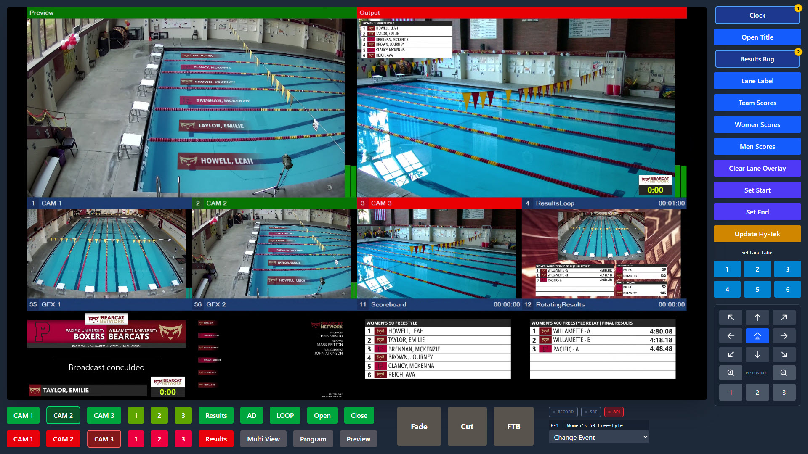

# Remote Production though a sinlge url

Since the proliferation of Zoom, video conferencing, and remote work, I’ve been thinking of ways to leverage these technologies to support our broadcast productions. Willamette University is a small liberal arts college, and the students it attracts aren't typically drawn to "nuts and bolts" engineering roles. This often limits my local talent pool; however, removing the requirement to be on-premise greatly expands my prospective pool of help.

While I’ve built several tools over the last couple of years, most were merely proof-of-concept. By leveraging AI, I’ve been able to move from an idea to a working demo much faster on recent projects.

My latest project is a remote production dashboard. I wanted to build a tool where I could simply send someone a link and login credentials, and that’s all they would need to direct a broadcast. Since our productions run on vMix, I utilized vMix Call for audio and video transport.

### How it Works:

* **The Interface:** The remote "caller" receives the Program feed, comms audio, and a Multiview video return.

* **The Audio:** The caller’s audio is routed through vMix and into our Dante comms infrastructure.

* **The Backend:** I built a custom web interface around the vMix Call iframe. Because the webserver is on-premise, I don’t need proxies to communicate with vMix; I use PHP on the server to translate web requests into vMix API calls.

### The Stress Test

Yesterday provided the perfect stress test: a swim meet and a basketball game scheduled at the same time. I found a volunteer to run the swim broadcast remotely, sent him the link, and he was up and running immediately. He directed the entire broadcast from across the country using nothing but a single webpage.

This project evolved from a proof-of-concept to a tool I can reliably leverage when I’m short on staff. The next step? Tweaking the interface for baseball and softball this spring.

<iframe src="https://www.youtube.com/embed/0UvTXa0n1zY" title="YouTube video player" frameborder="0" allow="accelerometer; autoplay; clipboard-write; encrypted-media; gyroscope; picture-in-picture; web-share" allowfullscreen></iframe>

